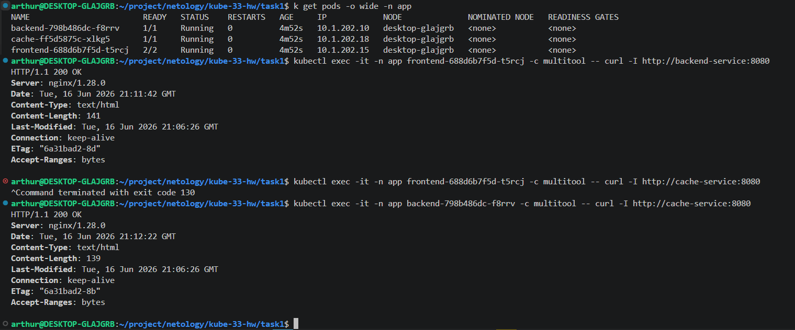

# Домашнее задание к занятию «Как работает сеть в K8s»

### Цель задания

Настроить сетевую политику доступа к подам.

### Чеклист готовности к домашнему заданию

1. Кластер K8s с установленным сетевым плагином Calico.

### Инструменты и дополнительные материалы, которые пригодятся для выполнения задания

1. [Документация Calico](https://www.tigera.io/project-calico/).
2. [Network Policy](https://kubernetes.io/docs/concepts/services-networking/network-policies/).
3. [About Network Policy](https://docs.projectcalico.org/about/about-network-policy).

-----

### Задание 1. Создать сетевую политику или несколько политик для обеспечения доступа

1. Создать deployment'ы приложений frontend, backend и cache и соответсвующие сервисы.
2. В качестве образа использовать network-multitool.
3. Разместить поды в namespace App.
4. Создать политики, чтобы обеспечить доступ frontend -> backend -> cache. Другие виды подключений должны быть запрещены.
5. Продемонстрировать, что трафик разрешён и запрещён.

### Правила приёма работы

1. Домашняя работа оформляется в своём Git-репозитории в файле README.md. Выполненное домашнее задание пришлите ссылкой на .md-файл в вашем репозитории.
2. Файл README.md должен содержать скриншоты вывода необходимых команд, а также скриншоты результатов.
3. Репозиторий должен содержать тексты манифестов или ссылки на них в файле README.md.


## Решение

### Задание 1.

Снова полезные команды:
```bash
alias k8s='microk8s'
alias k='k8s kubectl'
```
Проверяем конфиг
```bash
kubectl apply -f . --dry-run=client
```
Проверка не столько синтаксиса, сколько API которое мы подключаем в манифесте:
```bash
kubectl apply -f . --dry-run=client --validate=false
```

Разворачиваем наши поды
```bash
kubectl apply -f .
```

#### Диагностика:
В процессе работы пришлось поковыряться с DNS. Ниже команда как посмотреть логи DNS
```bash
kubectl logs -n kube-system deployment/coredns --tail=20
```
Отключение всех политик:
```bash
kubectl delete networkpolicy --all -n app
```
Посмотреть какие порты биндят контейнеры пода frontend
```bash
kubectl exec -it frontend-688d6b7f5d-5xq49 -n app -c multitool -- ss -tlnp
```
Проверить доступ между подами backend <-> frontend:
```bash
kubectl exec -it backend-798b486dc-9tqp2 -n app -c multitool -- curl -I http://frontend-service:9001
```
ВАЖНО! Настройку сети можно подсмотреть [тут](https://habr.com/ru/companies/flant/articles/443190/)
Из статьи:
`В Kubernetes нет действия «запретить» (deny), однако аналогичного эффекта можно добиться с обычной (разрешающей) политикой, выбрав пустую группу pod'ов-источников (ingress)`

По заданию нужно организовать связь (frontend -> backend -> cache). Но так как TCP - stateful, то kubernetes "запоминает" новое соединение и разрешает гонять трафик в обе стороны. Фактически правила для TCP вешают ограничения на SYN-пакет. Поэтоу праила пишем только для `ingress` и только для pod-ов которые вытупают в "пассивной роли", то есть должны отвечать на подключения клиентов, а сами не инициируют соединений.
Более подробно [тут](https://kubernetes.io/docs/concepts/services-networking/network-policies/)

ВАЖНО! Все поды должны обращаться к DNS, а значит нам необходима политика и для kube-dns и `Service` для наших pod-ов.
Узнать label подов:
```bash
kubectl get pods -n kube-system --show-labels
```
У нашего DNS это `kube-dns`

Перечень Service
```bash
kubectl get svc -n app
```

#### Итог

Команды для проверки:
```bash
kubectl exec -it -n app frontend-688d6b7f5d-t5rcj -c multitool -- curl -I http://backend-service:8080
kubectl exec -it -n app frontend-688d6b7f5d-t5rcj -c multitool -- curl -I http://cache-service:8080
kubectl exec -it -n app backend-798b486dc-f8rrv -c multitool -- curl -I http://cache-service:8080
```
Первая и последняя должны выполниться успешно.



**P.S. Пришлось отключить правило для dns, так и не понял, что ему не нравилось, но с этим правилом у меня не работала связь между pod-ами**
